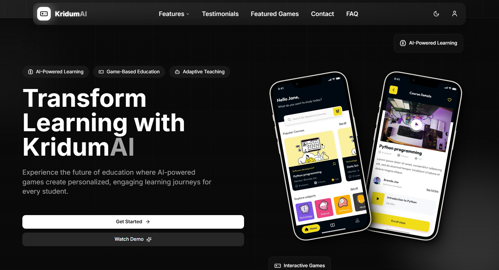

# TheGoodGameTheory - Educational Gaming Platform

A modern educational gaming platform built with Next.js, TypeScript, Tailwind CSS, and Shadcn UI components.

## Tech Stack

- Next.js
- TypeScript
- Tailwind CSS
- Shadcn UI



## Features

- Game-based learning experiences
- AI-powered personalized education
- Comprehensive educator tools
- Dark/Light mode toggle
- Fully responsive design
- Modern UI with smooth animations

## Sections

- Hero section with clear value proposition
- Featured educational games
- Testimonials from educators and students
- Benefits of game-based learning
- Team showcase
- Pricing plans
- FAQ section
- Contact form
- Mobile-friendly navigation

## Getting Started

1. Clone the repository:
   ```bash
   git clone https://github.com/yourusername/TheGoodGameTheory.git
   cd TheGoodGameTheory
   ```

2. Install dependencies:
   ```bash
   npm install
   # or
   yarn install
   # or
   pnpm install
   ```

3. Run the development server:
   ```bash
   npm run dev
   # or
   yarn dev
   # or
   pnpm dev
   ```

4. Open [http://localhost:3000](http://localhost:3000) in your browser to see the application.


